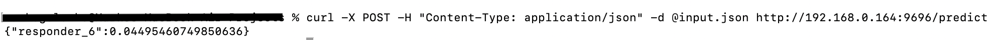

# Market-Data-Forecasting

This project includes building a model using real-world data derived from production systems, which offers a glimpse into the daily challenges of successful trading. Challenges of market data forecasting highlight the difficulties in modeling financial markets, including fat-tailed distributions, non-stationary time series, and sudden shifts in market behavior.

Project made in scope of machine learning zoomcamp midterm project.

## Data 

To download data use this command. Be aware size of it is 12G.

```bash
kaggle competitions download -c jane-street-real-time-market-data-forecasting
```

## Notebook

Notebook includes

- Data preparation
- Data cleaning
- EDA
- Feature importance analysis
- Model selection process
- Parameter tuning

## Model training

`train.py` consits final model training. Model saved to web_service/final_model.bin

## Web service

In web_service folder predict.py script reading model file and creating flask application for servnig model. Requirement specidfied in Pipfile. Web service contenirized with docker.

## How to run

To build web service run

```bash
docker build -t market-app web_service/
```

To run container 

```bash
docker run -p 9696:9696 market-app
```

## Deployment




Here's an improved version of your README.md file:

---

# Market Data Forecasting

This project aims to build a predictive model using real-world financial data, providing insights into the complexities and challenges of forecasting in trading environments. The model development highlights key difficulties in financial data modeling, such as fat-tailed distributions, non-stationary time series, and abrupt shifts in market behavior.

This project was developed as part of the Machine Learning Zoomcamp midterm project.

## Data 

The dataset used for training and testing the model is large (12GB) and can be downloaded using Kaggle CLI. Use the following command to download the dataset:

```bash
kaggle competitions download -c jane-street-real-time-market-data-forecasting
```

## Notebook

The notebook (`notebook.ipynb`) includes:

- **Data preparation and cleaning:** Initial data loading, handling missing values, and preprocessing steps.
- **Exploratory data analysis (EDA):** Insights and visualizations to understand the data.
- **Feature importance analysis:** Identifying and ranking key features for model training.
- **Model selection and parameter tuning:** Comparing models and fine-tuning parameters to optimize performance.

## Model training

The script `train.py` trains the final model, saving it to `web_service/final_model.bin` for later use in prediction.

## Web service

The `predict.py` script, located in the `web_service` folder, loads the saved model and serves it via a Flask web application. The required dependencies are listed in the Pipfile, and the service is containerized with Docker for easy deployment.

## Running the service

To build the web service, use the following command:

```bash
docker build -t market-app web_service/
```

Then, to run the container, use:

```bash
docker run -p 9696:9696 market-app
```

The service will be accessible at `:9696/predict`.

## Deployment

To demonstrate deployment, a screenshot of the service in action is included:


